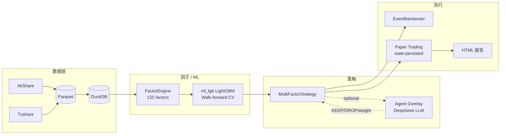
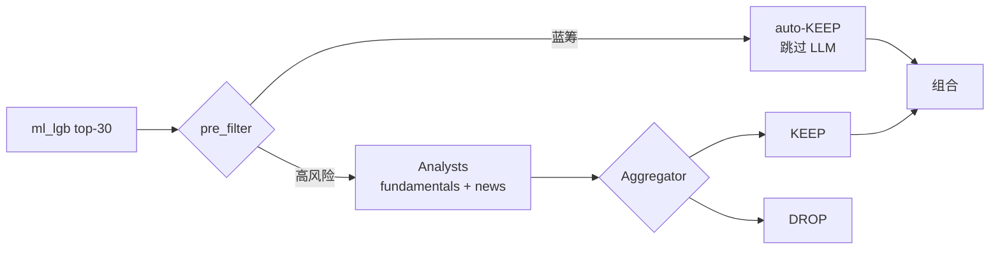

# OpenQuant — A股工业级量化交易系统

[](https://github.com/jwzheng96/OpenQuant/actions/workflows/tests.yml)
[](https://codecov.io/gh/jwzheng96/OpenQuant)
[](https://www.python.org/downloads/)
[](LICENSE)

覆盖 **数据 → 因子 → ML 模型 → 回测 → Paper Trading → 监控** 的中国A股量化全栈框架，
**真实盘桥（QMT / CTP）目前是 stub**，见下方 [实施状态](#实施状态) 表。
内置可选的 **LLM agent overlay**（TradingAgents 启发）作为量化选股后的"质量门"。

> ⚠️ **本系统不承诺盈利**。它提供的是稳健的工程基础设施和正确的 A股微观摩擦建模，alpha 仍需自行研究。

## 实施状态

| 模块 | 状态 | 说明 |
|---|---|---|
| `open_quant.data` | ✅ Production | 2.2M+ 行日线 / 6.4+ 年 / 1799 票 / AkShare 直连 EM |
| `open_quant.factors` | ✅ Production | 125 因子（Baseline 10 + Alpha101 57 + GTJA Alpha191 55 + ML 3）|
| `open_quant.backtest` | ✅ Production | 事件驱动 + A股规则（T+1/涨跌停/停牌/成本）|
| `open_quant.strategies` | ✅ Production | `MultiFactorStrategy` 跑通；CTA / Event-driven 是简化版 |
| `open_quant.portfolio` | ⚠️ Partial | cvxpy 优化器 + 中性化已实现；Barra 风险模型框架级 |
| `open_quant.agents` | ✅ Production | DeepSeek LLM + 多源新闻（CLS / 财新 / 公告）|
| `open_quant.paper_state` | ✅ Production | **仅对历史回放**；实时 paper 也可跑（见下） |
| `open_quant.execution` (OMS) | ✅ Production | 订单状态机 + 风控钩子 + 对账逻辑 |
| `open_quant.execution.PaperBroker` | ✅ Production | 内存撮合 |
| `open_quant.execution.QMTBroker` | ❌ **Stub** | `submit/cancel/query` 全是 `NotImplementedError`，需要 QMT 账号 + xtquant wire-up |
| `open_quant.execution.CTPBroker` | ❌ **Stub** | 同上，期货 vnpy_ctp 桥未实现 |
| `open_quant.monitor.Metrics` (Prom) | ⚠️ Framework | 指标定义齐了，未在实盘 loop 里调用过 |
| `open_quant.monitor.AlertManager` | ⚠️ Framework | 飞书/钉钉 webhook 代码有，**生产 webhook 未配过** |
| `open_quant.monitor.daily_report` | ✅ Production | Paper trading HTML 报告每天产 |
| `open_quant.pipelines` (Prefect) | ⚠️ Framework | flow 装饰器在，但 **scheduler 从未启动过实盘 loop** |

**结论**：当前系统是一个**完备的研究 + paper trading 平台**，**不是实盘交易系统**。
上实盘还需要：开 QMT 账号 → wire `QMTBroker` → 实时行情接入 → paper 2-4 周 → 灰度小资金。
详见 [docs/ROADMAP_TO_LIVE.md](docs/ROADMAP_TO_LIVE.md)。

## 系统一览



详见 [docs/ARCHITECTURE.md](docs/ARCHITECTURE.md)。

## 实测结果一览（OOS 严格 holdout，模型只见 2020-2023，测 2024-2026）

| 策略 | 累计收益 | Sharpe | MDD | 对比 HS300 同期 |
|---|---|---|---|---|
| ml_lgb_strict (3.4年) | **+227.94%** | 1.40 | -23.8% | HS300 +26.59%，超额 +201pp |
| ml_lgb_strict (2.4年 OOS) | **+100.35%** | 1.30 | -22.2% | HS300 +45.34%，超额 +55pp |
| 2022 熊市压力测试 | **+12.85%** | 0.57 | -31.0% | HS300 **-21.27%**，超额 +34pp |
| ml_lgb + Barra 中性化 | +29.37% | 0.71 | -27.6% | 真 alpha 部分（剥风格后）|

详细方法学和警示：见 [RESULTS.md](RESULTS.md)

## 数据资产

| 类别 | 规模 |
|---|---|
| 股票池 | **1799** 只（HS300 + CSI500 + CSI1000 全员，99.8% canonical 覆盖）|
| 日线 | **2.2M+** 行 / 2020-01-02 → 今日（**6.4+ 年**）|
| 估值（PE/PB/MV）| **685k** 行 / 2021-05 起（akshare 近五年上限）|
| 因子 | **125 个**（10 baseline + 57 Alpha101 + 55 GTJA Alpha191 + ml_lgb 系列）|
| 测试 | 74/74 ✅ |

## 快速开始

```bash
# 1. 环境（推荐 uv）
uv venv -p 3.11 && source .venv/bin/activate
uv pip install -e ".[dev]"

# 2. 起依赖服务（可选，仅 paper/live 需要）
docker compose up -d   # ClickHouse + Postgres + Grafana + Prefect

# 3. 配置数据源
cp configs/data_sources.example.yaml configs/data_sources.yaml
# 编辑填入 Tushare token + DeepSeek api_key（agent overlay 用）

# 4. 初始化数据（拉历史，约 30-60 分钟）
python scripts/sync_hs300_top50.py     # HS300 头部 50 只
python scripts/sync_zz500.py           # 加上 ZZ500
python scripts/sync_2025_2026.py       # 同步到今天

# 5. 训练 ml_lgb（5-10 分钟）
python scripts/train_ml_composite.py

# 6. 跑严格 OOS 验证
python scripts/train_strict_holdout.py

# 7. 跑 paper trading
python scripts/paper_daily.py \
  --config configs/strategies/mf_ml_strict.yaml \
  --from 2024-01-02 --to 2026-05-25 --reset

# 8. 看 HTML 详细报告
open data/paper_state/mf_ml_strict/report.html
```

## CLI 速览

```bash
# 数据
open-quant data init --start 2020-01-01
open-quant data check
open-quant data sync --dataset daily

# 因子
open-quant factor list           # 125 个因子列表
open-quant factor eval mom_20d   # 单因子 IC 评估

# 回测
open-quant backtest run --config configs/strategies/mf_ml_strict.yaml

# Agent overlay（LLM 二审）
open-quant agents config         # 查看 LLM 配置
open-quant agents test 600519.SH # 单股 4-agent 评估
open-quant agents eval --from ... --to ...   # A/B 量化 vs LLM
open-quant agents cache --clear
```

## 因子库

按来源分（共 125 个）：

| 类别 | 数量 | 内容 |
|---|---|---|
| **Baseline** | 10 | bp / ep / roe / size / mom_20d / mom_60d / reversal_5d / vol_20d / turnover_20d / amihud_20d |
| **WorldQuant Alpha101** | 57 | 公式化 alpha（来自 arXiv:1601.00991） |
| **国泰君安 Alpha191** | 55 | A 股本土量价因子，SMA Wilder 风格 |
| **ML composite** | 3 | ml_lgb / ml_lgb_strict / ml_lgb_bear2022 |

详见 `src/open_quant/factors/`。

## A 股特有约束（已实现）

- **T+1** 锁仓
- **涨跌停**：沪深主板 10% / 创业板 + 科创板 20% / 北交所 30% / ST 5%（不同板块自动适配）
- **停牌 / 退市** 标记
- **复权**（前复权 / 后复权 / 不复权 — 涨跌停判定用不复权）
- **印花税** 0.05%（卖出）+ **过户费** 0.001%（双边）+ 佣金可配
- **集合竞价 vs 连续竞价** 时间窗
- **滑点**（按成交量比例 / bps / 固定 三种模式）

详见 [`src/open_quant/backtest/ashare_rules.py`](src/open_quant/backtest/ashare_rules.py)。

## Agent Overlay（可选 — LLM 二审）

在量化选出 top-N 候选股后，可选地用 LLM 评估每只是否值得留下：



```yaml
# configs/strategies/your_strategy.yaml
qualitative_overlay:
  enabled: true                     # 一键开关
  agents:
    fundamentals: true              # 财务暴雷、估值异常
    news: true                      # CLS 立案、财务差错更正
    technical: false                # ml_lgb 已吃透，关掉
  pre_filter:
    only_risky: true                # 蓝筹自动 KEEP，节省 LLM 成本
  decision:
    veto_threshold: 0.85
```

**实测**：DeepSeek-V4-flash，单股 4 agent 调用约 ¥0.013，30 股池一年 ~¥98。

**新闻来源**：
- 财联社全球资讯（`stock_info_global_cls`）— 实时市场暴雷快讯
- 财新主新闻（`stock_news_main_cx`）— 主流财经
- 巨潮个股公告（`stock_zh_a_disclosure_report_cninfo`）— 财务差错 / 立案 / 重大事项

详细 A/B 评估（4 轮迭代）：见 [RESULTS.md](RESULTS.md) 第 12 节。

## 模块速览

完整状态见 [实施状态](#实施状态)；下面只列文件 / 作用。

| 模块 | 作用 |
|---|---|
| `open_quant.data` | 数据采集、复权、标的池、A股日历 |
| `open_quant.factors` | 因子计算引擎 + 因子库 + IC/IR 评估 |
| `open_quant.backtest` | A 股精确事件回测 + 成本模型 + 微观规则 |
| `open_quant.strategies` | 多因子日频 / Dual Thrust CTA / 业绩驱动 |
| `open_quant.portfolio` | 组合优化器（cvxpy）+ 中性化 |
| `open_quant.execution` | OMS（实现）+ PaperBroker（实现）+ QMT/CTP（**stub**）|
| `open_quant.monitor` | Prometheus 指标 + 飞书/钉钉告警 + HTML 日报 |
| `open_quant.agents` | LLM 二审（toolkit / overlay / prompts）|
| `open_quant.paper_state` | Paper trading 状态持久化 (JSON) |
| `open_quant.pipelines` | Prefect 调度框架（**未启动过 live loop**）|

## 文档

- [ARCHITECTURE.md](docs/ARCHITECTURE.md) — 系统架构 + 流程图
- [RESULTS.md](RESULTS.md) — 完整实测结果 + 方法学
- [CONTRIBUTING.md](CONTRIBUTING.md) — 贡献指南
- [notebooks/01_quickstart.ipynb](notebooks/01_quickstart.ipynb) — 5 分钟上手 demo

## License

[Apache License 2.0](LICENSE)。

本项目仅供研究和自营资金量化策略开发使用，**不构成投资建议**。
任何在实盘使用本系统造成的资金损失，**项目维护者不承担任何责任**。
