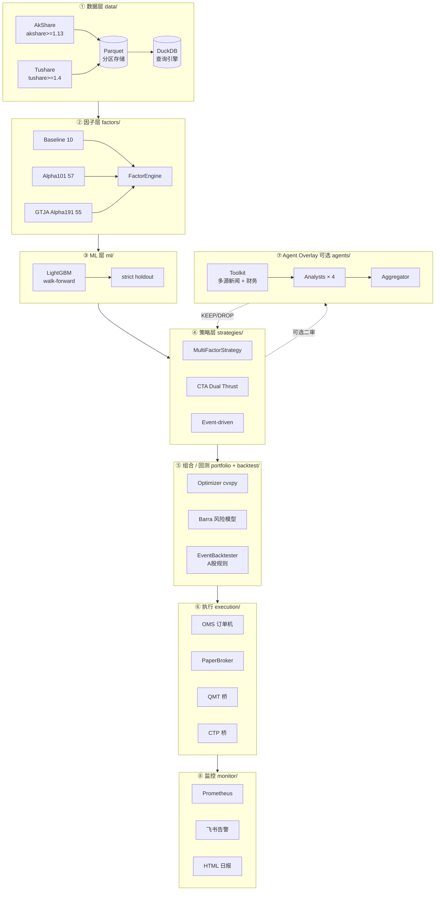
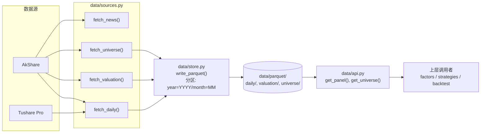
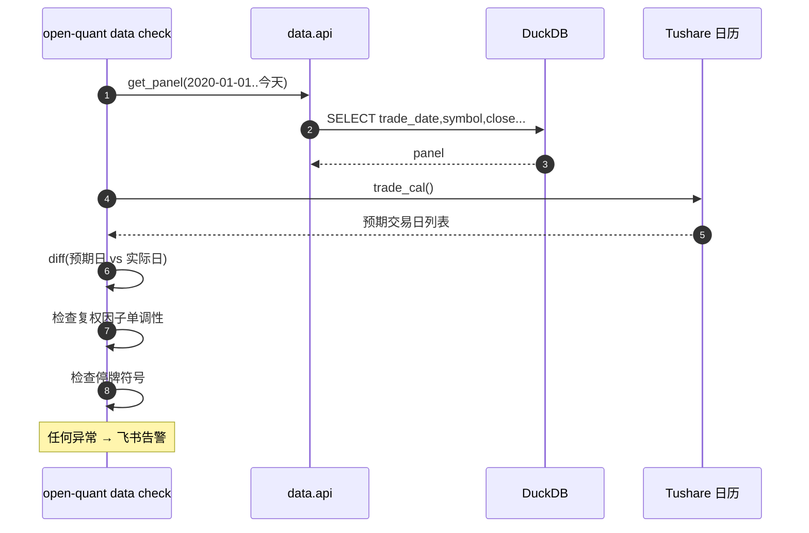
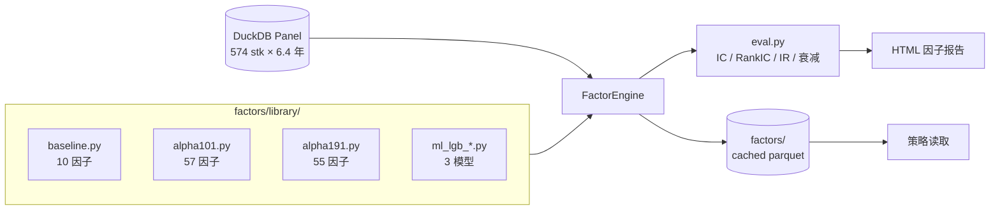
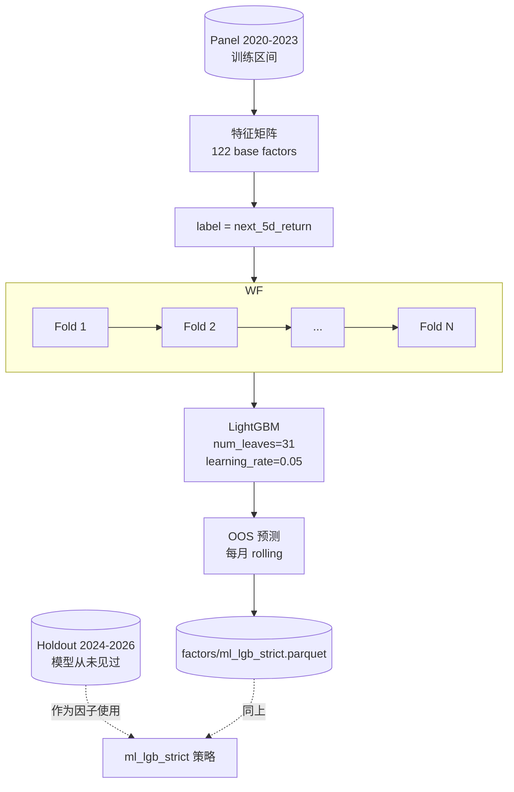
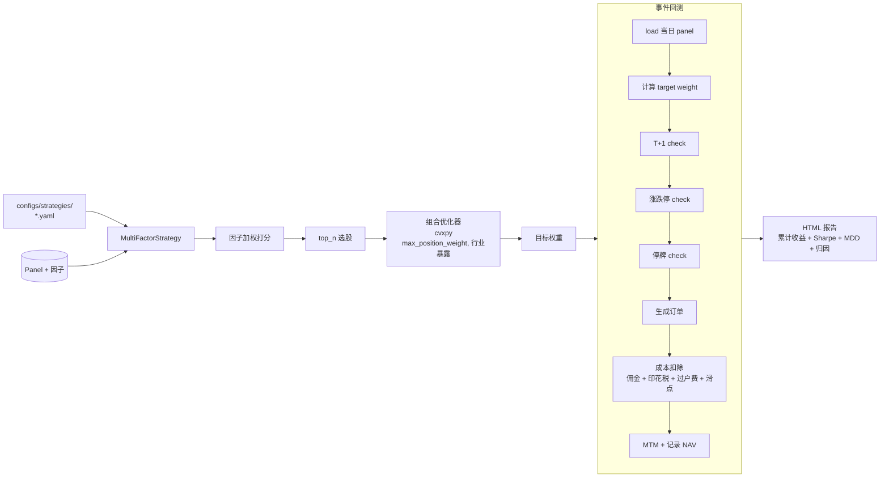
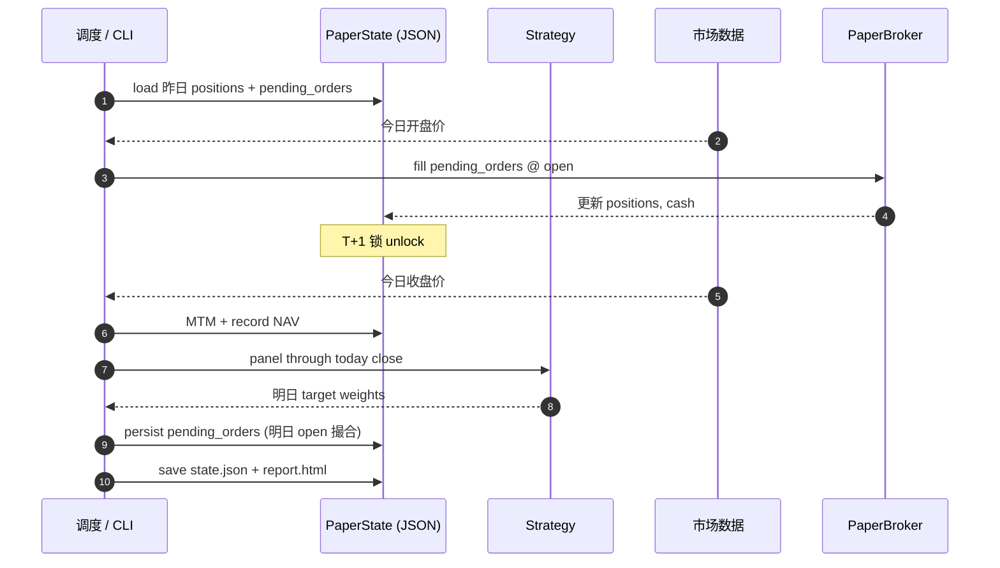
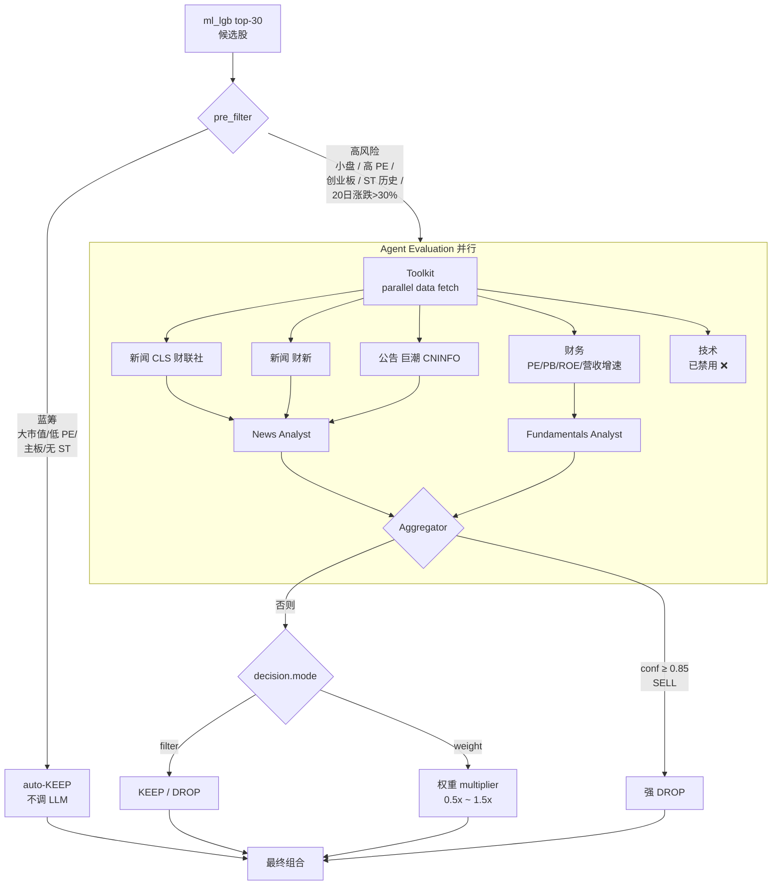

# OpenQuant 架构说明

> 工业级 A 股量化系统，分层清晰、每层可独立测试 / 替换。
> 本文档配合源码阅读，所有流程图用 ```` ```mermaid ```` 围栏，GitHub 原生渲染。

## 目录

1. [系统全景](#1-系统全景)
2. [数据层](#2-数据层)
3. [因子层](#3-因子层)
4. [ML 训练流水线](#4-ml-训练流水线)
5. [策略与回测](#5-策略与回测)
6. [Paper Trading 状态机](#6-paper-trading-状态机)
7. [LLM Agent Overlay](#7-llm-agent-overlay)
8. [目录布局](#8-目录布局)
9. [扩展点](#9-扩展点)

---

## 1. 系统全景

OpenQuant 是一个**分层、可替换**的量化系统，每一层只依赖下层的稳定接口：



每层的边界都是**纯 Python 函数 / Pydantic 数据类**，所以可以单测、可以替换实现（比如把 Tushare 换成 Wind 不影响上面）。

---

## 2. 数据层

### 2.1 数据源 & 存储



### 2.2 A股微观摩擦 — 都封装在 `backtest/ashare_rules.py`

复权三种模式都保留：

| 用途 | 模式 | 为什么 |
|---|---|---|
| 实盘下单 | 不复权 | 涨跌停按**当日实际价**判定 |
| 研究 / 回测信号 | 前复权 | 避免历史除权造成的价跳变 |
| 长期累计收益 | 后复权 | 与净值曲线一致 |

涨跌停规则按板块自动选：

| 板块 | 涨跌幅限制 |
|---|---|
| 沪深主板 | ±10% |
| 创业板 / 科创板 | ±20% |
| 北交所 | ±30% |
| ST / *ST | ±5% |

### 2.3 数据完整性自检



---

## 3. 因子层

125 个因子按来源分库；引擎统一从面板 (DataFrame) 计算到面板 (DataFrame)：



注册新因子只需在 `factors/library/` 加文件 + 在 `factors/__init__.py` 暴露名字 — `default_engine()` 自动收录。

---

## 4. ML 训练流水线

`ml_lgb_strict` 是当前最关键的 composite：



**严格性**：模型只在 2020-2023 训练，2024-2026 是真 OOS。这就是为什么 README 里 +100% / +228% 的数字是诚实的 — 数据未来从未泄漏。

---

## 5. 策略与回测

策略输出"目标权重"，回测引擎按 A 股微观规则模拟撮合：



事件回测 (`backtest/event_backtester.py`) 和 paper trading 共用同一份 `ashare_rules.py` — 这是"回测-实盘不偏离"的核心保证。

---

## 6. Paper Trading 状态机

`scripts/paper_daily.py` 每天前进一步，状态全部 JSON 持久化在 `data/paper_state/<strategy>/`：



**为什么需要状态机**：A股 T+1 让"昨日买、今日不能卖"变成强约束，必须有状态来记录每只票的可卖份额。状态机让 paper trading 可断点续跑 — 中断了不丢数据。

---

## 7. LLM Agent Overlay

可选的 LLM 二审层。在量化选出 top-N 后，对每只候选股做"质量门"评估：



### 7.1 多源新闻的设计动机

A 股暴雷往往**先在财联社快讯出现**（"立案调查"、"财务差错更正"等关键词），主流财经媒体要慢半天到一天。所以新闻 toolkit 同时拉 3 个源：

| 来源 | AkShare endpoint | 内容侧重 | 实测延迟 |
|---|---|---|---|
| 财联社全球资讯 | `stock_info_global_cls` | 实时市场快讯，立案 / 停牌 / 重大事项 | ~分钟级 |
| 财新主新闻 | `stock_news_main_cx` | 主流财经，深度分析 | ~小时级 |
| 巨潮公告 | `stock_zh_a_disclosure_report_cninfo` | 财务差错更正、公司公告 | T+1 |

market-wide 拉一次缓存 60 分钟，单股按 `stock_news_em` 兜底。

### 7.2 实测对比（4 轮 A/B，2024-01-02 → 2026-05-25）

| 配置 | 累计收益 | 对 OFF 差距 | Sharpe |
|---|---|---|---|
| OFF (纯量化基线) | +3.71% | — | 5.86 |
| v1 broken news | +2.63% | -1.08pp | — |
| v3 multi-source news | +3.03% | -0.69pp | 6.53 |
| v4 deepseek-v4-pro | +2.74% | -0.98pp | 8.49 |
| **vB no-technical + filter** | **+3.26%** | **-0.45pp** | — |
| vC no-technical + weight | +3.71% | 0pp（太软）| — |

**结论**：technical agent 关掉效果最好 — ml_lgb 已经吃透量价信息，LLM 看 K 线反而误杀小盘 winner。

详细方法学：见 [RESULTS.md](../RESULTS.md) 第 12 节。

---

## 8. 目录布局

```
chuanye/                                # 历史仓库名，包名是 open_quant
├── src/open_quant/
│   ├── data/          # ① 数据层 (sources, store, calendar, adjust, universe, api)
│   ├── factors/       # ② 因子层 (engine, library/, eval)
│   ├── ml/            # ③ ML 训练 (composite, walkforward)
│   ├── strategies/    # ④ 策略 (multi_factor, cta, event_driven)
│   ├── portfolio/     # ⑤ 组合优化 + Barra 风险
│   ├── backtest/      # ⑤ 事件回测 + 成本模型 + A股规则
│   ├── execution/     # ⑥ OMS + 各类 broker
│   ├── monitor/       # ⑧ 指标 + 告警 + 报告
│   ├── agents/        # ⑦ LLM 二审 (toolkit, overlay, prompts, aggregator)
│   ├── paper_state/   # paper trading 状态机
│   ├── cli.py         # `open-quant ...` 入口
│   └── config.py
├── configs/strategies/   # 每个策略一份 YAML
├── tests/                # 74 个测试 (data/factors/backtest/agents)
├── scripts/              # sync_*.py / train_*.py / paper_daily.py
├── notebooks/            # 01_quickstart.ipynb
└── docs/                 # 当前文档
```

---

## 9. 扩展点

| 想做什么 | 改哪 | 测试在哪 |
|---|---|---|
| 加一个新因子 | `src/open_quant/factors/library/` 新增文件 → 在 `__init__.py` 暴露 | `tests/factors/` |
| 加一个数据源 | `src/open_quant/data/sources.py` 新增 fetcher 函数 | `tests/data/` |
| 加一类 broker | `src/open_quant/execution/brokers/` 实现 `BrokerBase` 接口 | `tests/execution/` |
| 改 A 股规则 | `src/open_quant/backtest/ashare_rules.py`（事件回测和 paper 共享）| `tests/backtest/` |
| 加一个 Analyst | `src/open_quant/agents/analysts/` 新增 + 在 overlay 注册 | `tests/agents/` |
| 接 Wind 数据 | 实现 `data/sources/wind.py`，配置切到它 | `tests/data/` |

每个扩展点都有现成的兄弟实现可参考；接口稳定，加 feature 不会动到其他层。

---

## License

[Apache License 2.0](../LICENSE)
